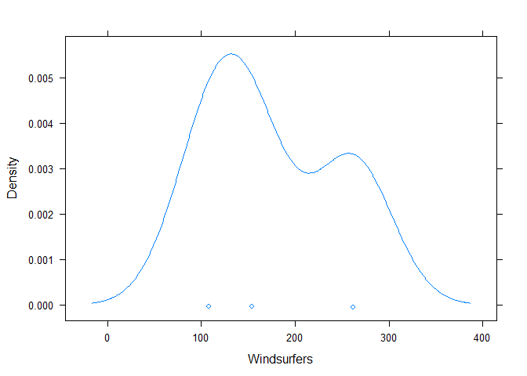
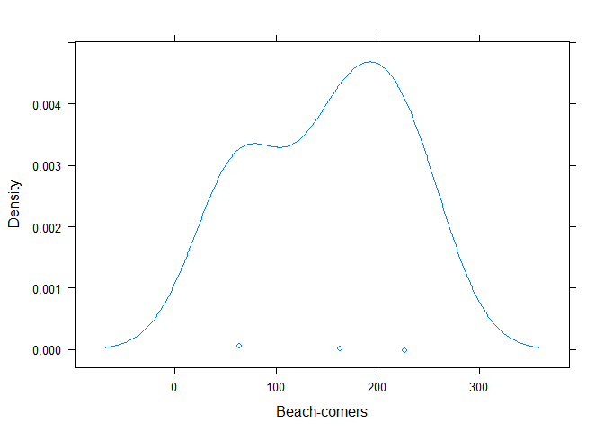

Advanced Statistics Module 11
================

``` r
library(readxl)
df <- read.csv("C:/Users/adamw/Documents/Advanced Statistics/Datasets/Module 11 Data.csv", row.names=1)
df
```

          Beachcomber Windsurfer Total
    Yes           163        154   317
    No             64        108   172
    Total         227        262   489

First we import the data from an excel spreadsheet to a csv file named 'df' and conduct the chi-squared test.

``` r
chisq.test(df)
```


        Pearson's Chi-squared test

    data:  df
    X-squared = 9.0526, df = 4, p-value = 0.0598

Here we see our critical values of the chi-squared test. We can see that the initial degrees of freedom are 4, and our p-value is .0598. Our null hypothesis in this case would be that whether someone is a beach-comer or a windsurfer has no effect on them choosing the same hotel again. Since we have a low p-value, there is evidence against this null hypothesis and we can infer that being a beach-comer or a windsurfer does in fact influence how likely one is to stay at the same hotel.

We can also take a look at other values of our chi-squared test such as the expected and residual numbers based off of our observed values in our dataset.

``` r
chitest = chisq.test(df)
chitest$expected
```

          Beachcomber Windsurfer Total
    Yes     147.15542  169.84458   317
    No       79.84458   92.15542   172
    Total   227.00000  262.00000   489

``` r
chitest$residuals
```

          Beachcomber Windsurfer Total
    Yes      1.306149  -1.215780     0
    No      -1.773201   1.650518     0
    Total    0.000000   0.000000     0

Next, we will graph the outcome of our chi-squared testing.

``` r
library("lattice")
densityplot(df$Beachcomber ~ df$Windsurfer, xlab = "Windsurfers")
```



``` r
densityplot(df$Windsurfer ~ df$Beachcomber, xlab = "Beach-comers")
```



These density graphs show the relationship between beach-comers and windsurfers and how likely they are to overlap at specific intervals.
